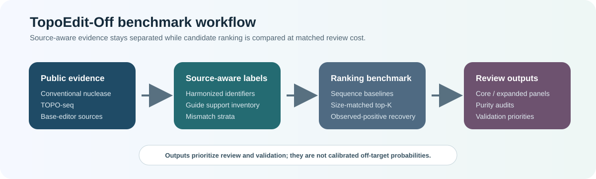

# TopoEdit-Off

[](https://doi.org/10.5281/zenodo.20154047)

**TopoEdit-Off** is a source-aware benchmark resource for high-mismatch genome-editing off-target prioritization.

This repository contains the public software/resource release accompanying the manuscript:

> **TopoEdit-Off: a source-aware benchmark for high-mismatch genome-editing off-target prioritization**

<p align="center">
  
</p>

## What this repository provides

TopoEdit-Off organizes public genome-editing off-target evidence into a compact, source-aware benchmark. The resource is designed to support:

- comparison of conventional nuclease, TOPO-seq, and base-editor observed-positive spaces;
- mismatch-regime analysis across evidence sources;
- size-matched top-K ranking evaluation;
- validation-priority panel design;
- reproducible access to compact benchmark summaries and release metadata.

This repository is intentionally minimal. It contains public-facing summary tables, ranking summaries, validation-priority panels, manifests, checksums, and a minimal smoke test. Large candidate-level derived tables are not stored in this GitHub repository.

## Key benchmark numbers

| Item | Value |
|---|---:|
| Guide panel | 100 guides |
| Generated candidate universe | 1,961,227 rows |
| Source-aware known-positive rows | 25,457 rows |
| Mismatch-6 candidate rows | 1,637,800 rows |
| TOPO source-positive guide support | 6 guides |
| Source-aware base-editor-positive guide support | 11 guides |
| Core validation-priority panel | 96 candidates |

## Repository structure

```text
data/benchmark/          Core source-aware benchmark summaries
data/ranking/            Size-matched top-K ranking evaluation
data/validation_panels/  Validation-priority candidate panels
demo/                    Minimal smoke test
metadata/                File manifest, checksums, and data dictionary
tools/                   Lightweight release validator
```

## Main public tables

| Path | Purpose |
|---|---|
| `data/benchmark/source_aware_label_inventory.tsv` | Summary of source-aware label counts |
| `data/benchmark/mismatch_bucket_coverage.tsv` | Mismatch-regime coverage by label subset |
| `data/benchmark/candidate_burden_by_family.tsv` | Candidate burden by evidence family |
| `data/ranking/size_matched_topk_recovery_summary.tsv` | Size-matched observed-positive recovery at top K |
| `data/ranking/delta_vs_sequence_baseline_summary.tsv` | Change in recovery relative to the sequence baseline |
| `data/ranking/rank_methods.tsv` | Ranking methods used in the public summary |
| `data/ranking/metric_definitions.tsv` | Metric definitions and interpretation notes |
| `data/validation_panels/validation_panel_core96.tsv` | Core validation-priority panel |
| `data/validation_panels/panel_tier_summary.tsv` | Core, expanded, and backup panel sizes |

## Minimal smoke test

The demo checks that the public release is readable and internally consistent. It does not rerun the full candidate-generation or model-training pipeline.

```bash
python -m pip install pandas
python demo/run_minimal_demo.py
cat demo/output/minimal_demo_summary.md
```

Expected generated files:

```text
demo/output/minimal_demo_summary.md
demo/output/top1000_recovery_summary.tsv
```

Run the repository validator:

```bash
python tools/validate_release.py --root .
```

Expected result:

```text
[PASS] minimal TopoEdit-Off public release validation passed.
```

## Interpretation policy

TopoEdit-Off reports **observed-positive recovery** and **validation-priority behavior**.

The resource does **not** claim that:

- unlabeled candidates are experimentally validated negatives;
- ranking scores are calibrated off-target probabilities;
- validation-priority panels are wet-validated panels;
- TOPO-seq or base-editor off-target biology is universally high-mismatch in every setting.

The intended use is benchmark analysis, source-aware comparison, and prioritization of candidate panels for future experimental validation.

## What is not included

This GitHub repository does not include raw SRA data, genome files, alignment outputs, BAM files, FASTQ files, or large candidate-level derived tables.

Large derived tables should be archived separately as Zenodo Dataset records when they are cited directly in the manuscript.

## Citation

Cite the archived Zenodo release: DOI `10.5281/zenodo.20154047`. See `CITATION.cff` for citation metadata.

## License

MIT.

## Version

v1.1.1
